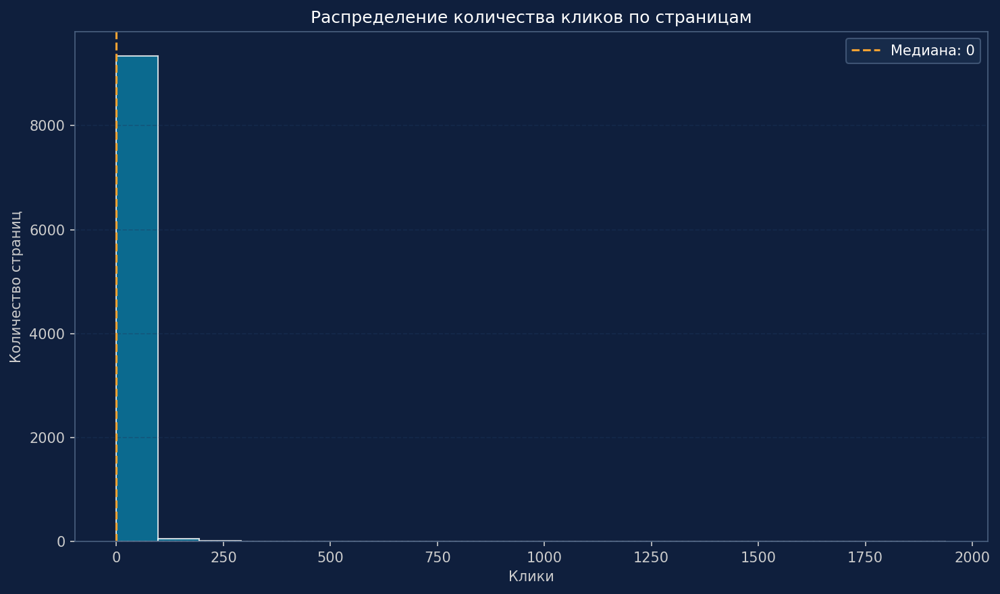
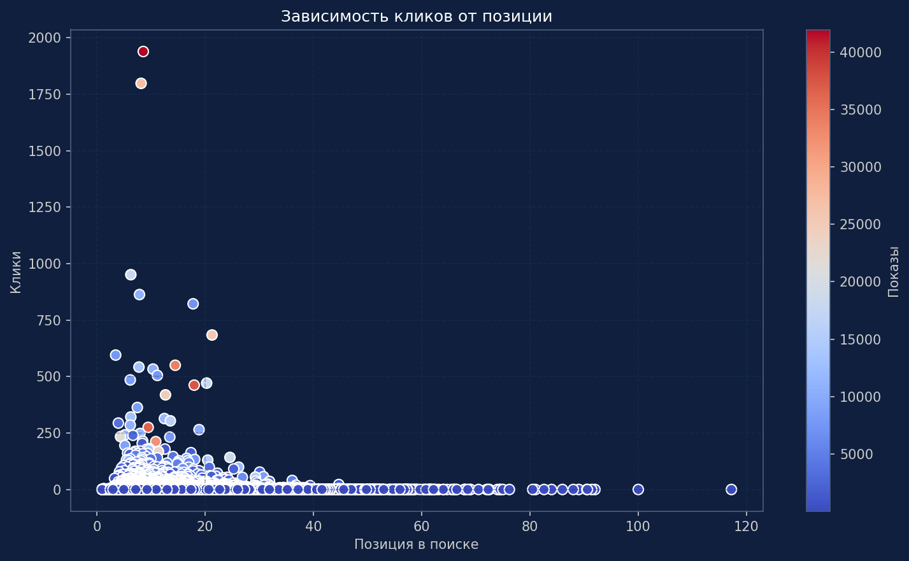
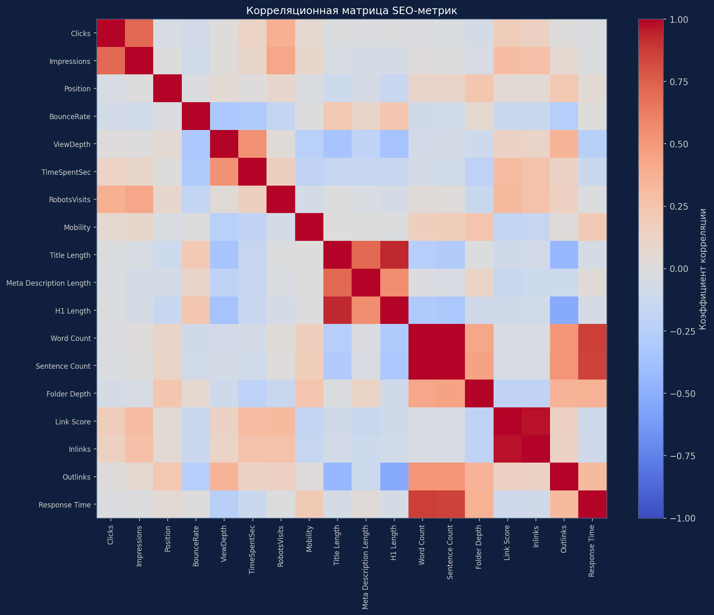
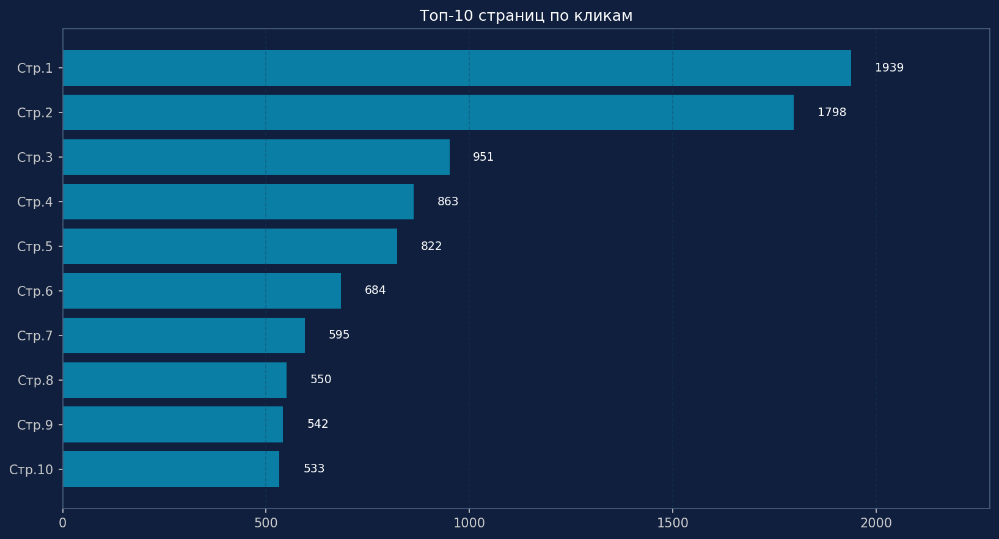
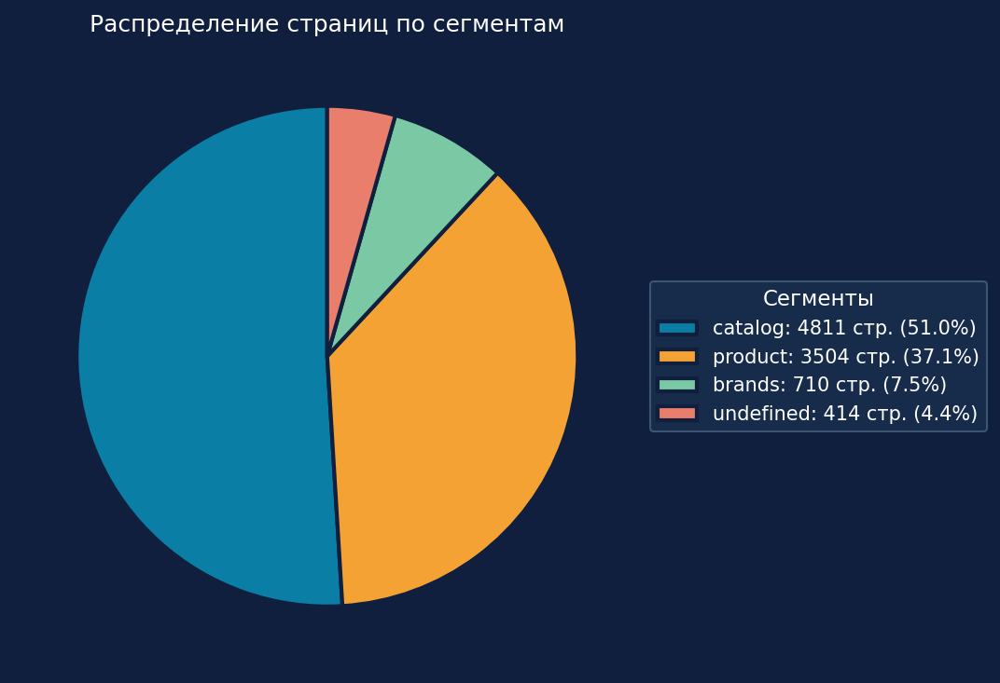
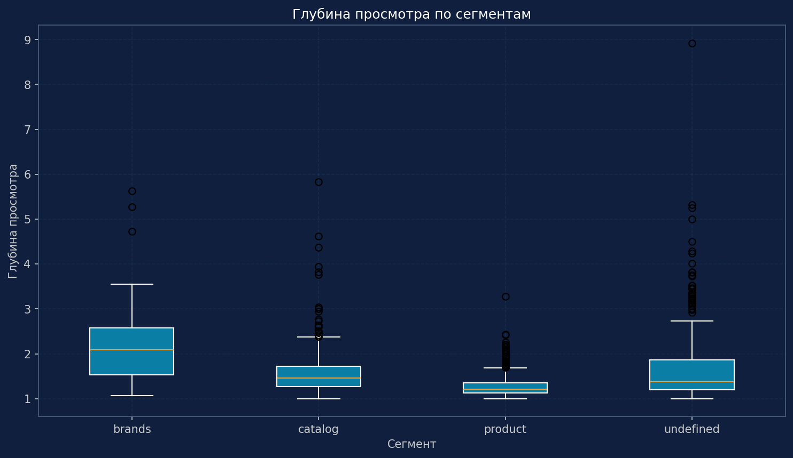
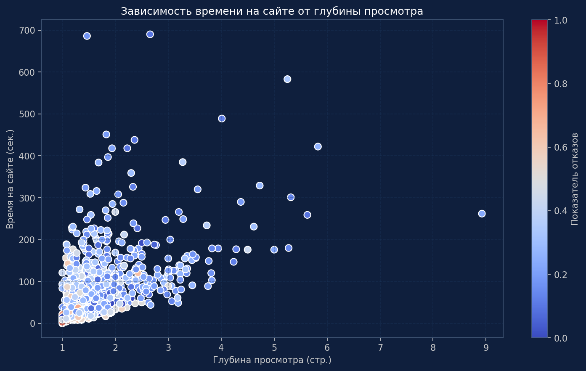
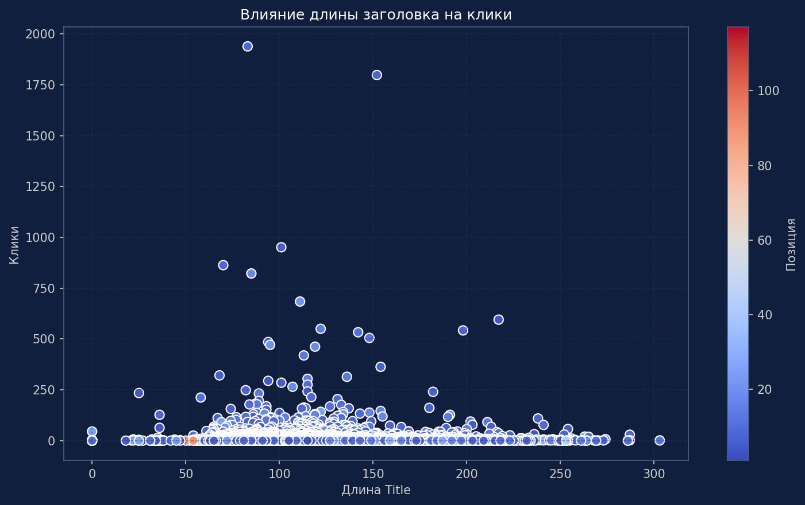

# DataScience аналитика

## Real-Website-Traffic-Prediction-VK — прогнозирование посещаемости сайта с использованием данных из VK.  
Проект из портфолио продуктового аналитика: построение модели предсказания трафика, анализ и визуализация результатов. 

## 🎯 Цель 
Продемонстрировать применение Data Science для решения задач роста аудитории.

